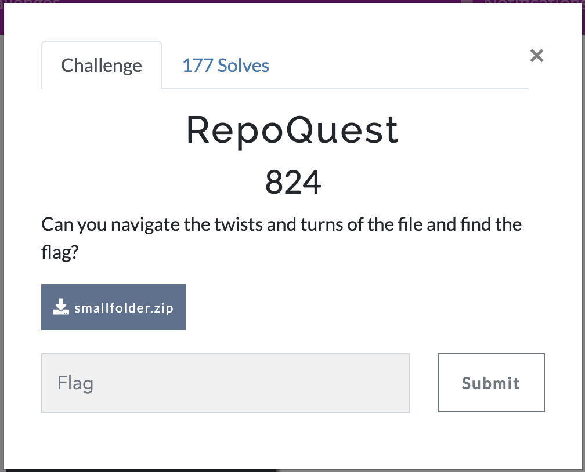
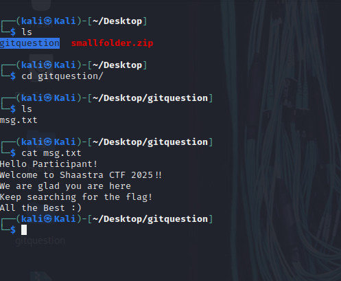
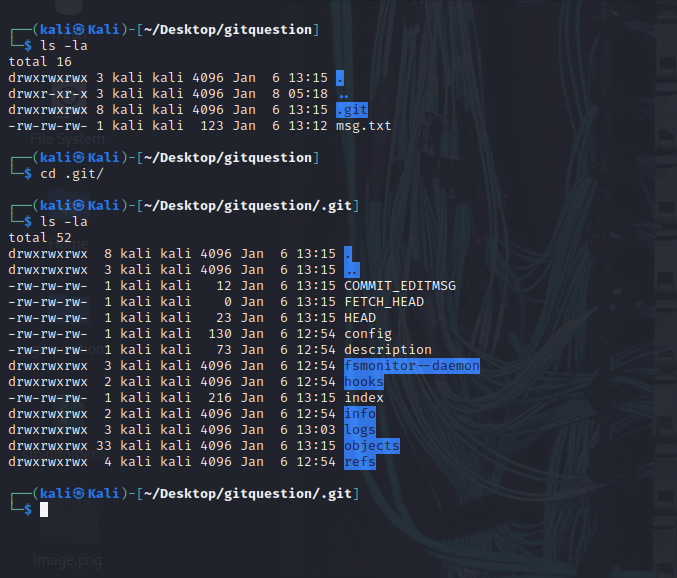
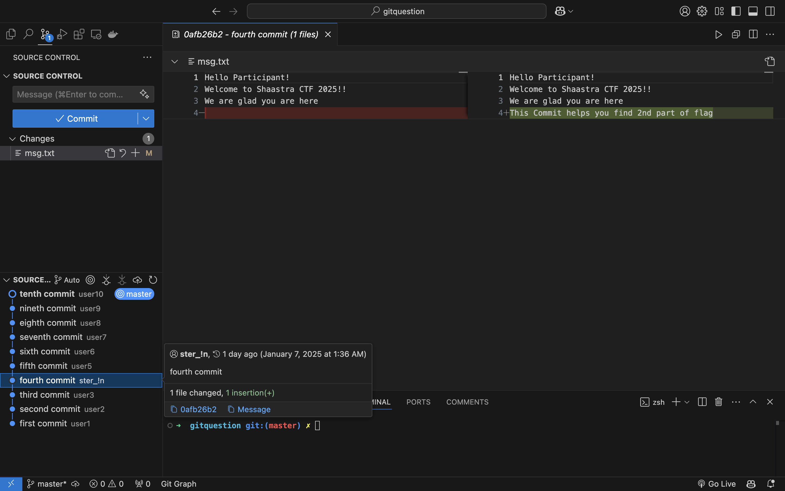
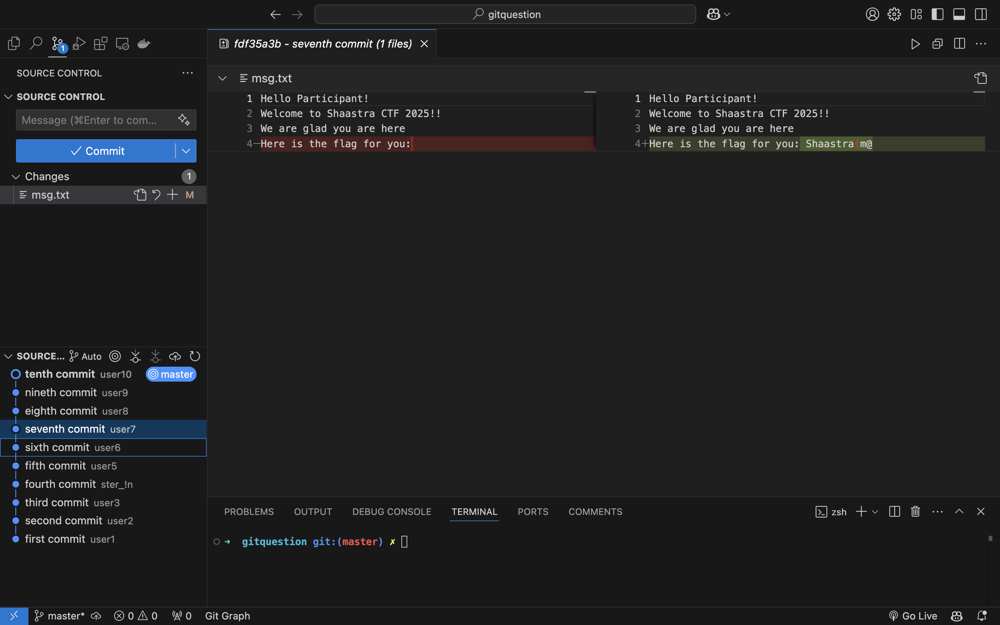
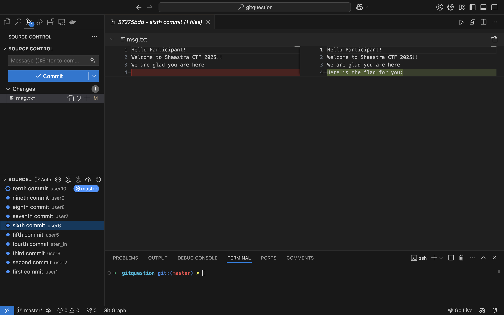
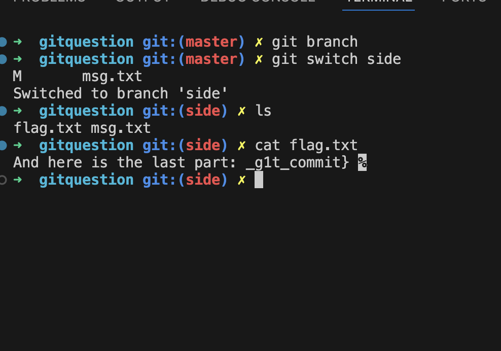

# RepoQuest

Can you navigate the twists and turns of the file and find flag?

## Step1:-


We are given a zip file. Let's open it in the terminal using the following command:
```bash
unzip smallfolder.zip
```

<p align="center">
  
</p>

## Step2:-

After extracting the file, we got a folder named <b>gitquestion<b>.
 As the name suggests, we might need to use Git commands or something similar.


<p align="center">
  
</p>
Examining the directory structure confirms that it is a Git repository.
<p align="center">
  
</p>

## Step3:-
To analyze what exactly is happening in this repository, we will use the Git Graph extension in VS Code. This helps visualize the commit history.
<p align="center">


</p>
Looking at the commits, we find that the fourth commit has a user ID that is slightly different from the others. It contains the partial string.

```ster_!n```

## Step4:-
From this clue, we deduce that the starting part of the flag is: ```Shaastra{M@```

<p>
  
</p>

## Step5:-
The sixth commit contains additional references to the flag. Let's investigate further.

  <p>
</p>
Checking for any branches in the repository reveals another hint. A branch contains more flag fragments, 
<p align="center">
  
</p>
Final flag is

```Shaasta{M@ster_!n_g1t_commit}```<br>
Thus, by carefully inspecting the commit history and branches, we successfully retrieved the full flag!