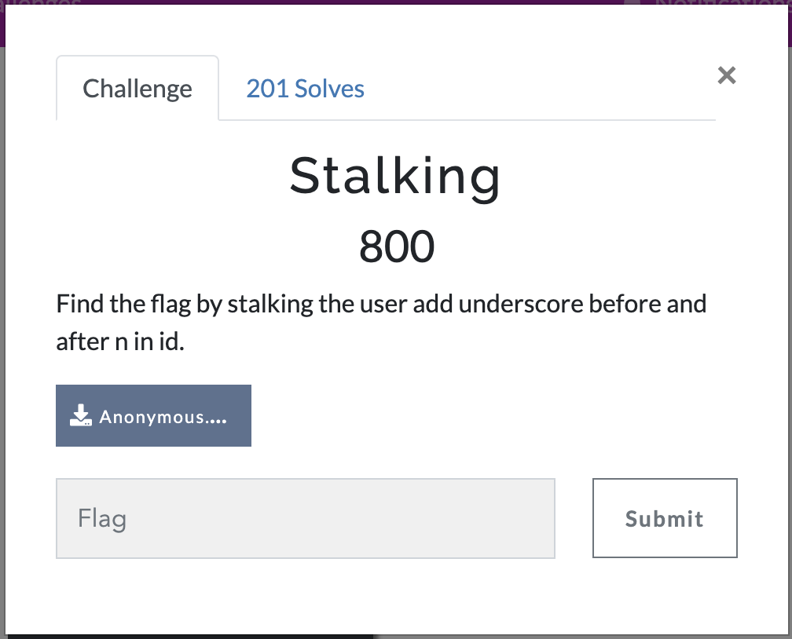
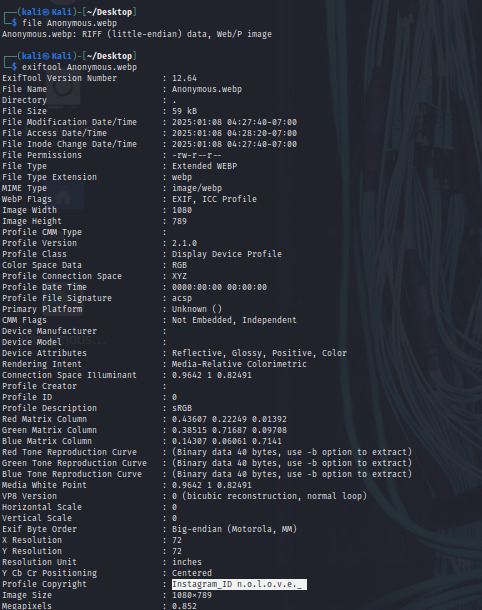

# Stalking

Find the flag by stalking the user add underscore before and after n in id.

<p align="center">
  
</p>

## Step:-1

In this question we are given a<b> Anonymous.webp</b> file.<br> <b>WebP</b> is a modern image file format that allows for lossy and lossless compression of images:
<br>lets find out more about file in terminal.

<p align="center">
  
</p>

## Step:-2
using ```exiftool``` a command-line tool used for reading, writing, and modifying metadata in various file formats, including images, videos, documents, and audio files. 
<p align="center">
  
</p>

here we found a Instagram id `n.o.l.o.v.e._`

## Step3:-
As the question suggest we need to add underscore before and after the n.<br> 
Therfore the user id become `_n_.o.l.o.v.e._`
After searching for this user on instagram. we will get the flag in comments section. 


