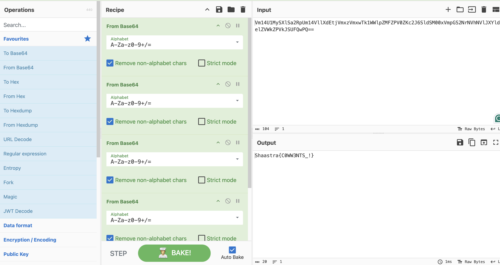

# Packets 
Run the script and find the flag.
<p align="center">
  
</p>

## Step1
The .pcapng.gz file is a network capture file compressed using Gzip. These files usually contain network traffic logs and can be analyzed using tools like Wireshark or tcpdump.

The recordfinder file is an LSB PIE (Position Independent Executable) binary, which means it is a dynamically linked executable designed for x86-64 architecture.

Let's first extract the .gz file using gunzip:
``` bash
gunzip Visit.pcapng.gz
```
<br>
After extraction, we now have Visit.pcapng, which can be analyzed using Wireshark.
<p align="center">
  
</p>

## Step 2
Before running recordfinder, we need to check its properties using 
```bash
ls -la
```
Since it lacks execution permissions, we need to grant them using:
```bash 
chmod +x recordfinder
```
Now, we can execute it:

```bash
./recordfinder
```

<p align="center">
  
</p>

## Step 3:-
When executed, recordfinder prompts us to enter a number. Based on our input, it either:

Provides a hint about the flag, if the number is correct.
Gives directional guidance (higher or lower), similar to a binary search algorithm, helping us narrow down the correct number.
<br>


<p align="center">
  
</p>
This suggests that the program has an internally stored target number that we need to guess.

## Step 4:-
After successfully guessing the number, the program provides a hint leading us to the .pcapng file.

To investigate, we open Visit.pcapng in Wireshark. Since we now have a specific frame number from the hint, we use Wireshark’s filter feature to locate the packet:

 ```bash
 frame.number==57356
 ```

<p align="center">
  
</p>
In the comment section of this packet, we discover an encoded message. This message likely contains crucial information related to the flag.

## Step 5:-
Since the message appears to be encoded, we use CyberChef, a tool widely used for encoding/decoding and cryptographic analysis.
<p align="center">
  
</p>

The Final flag is   ```Shaastra{C0WW3NTS_!}```