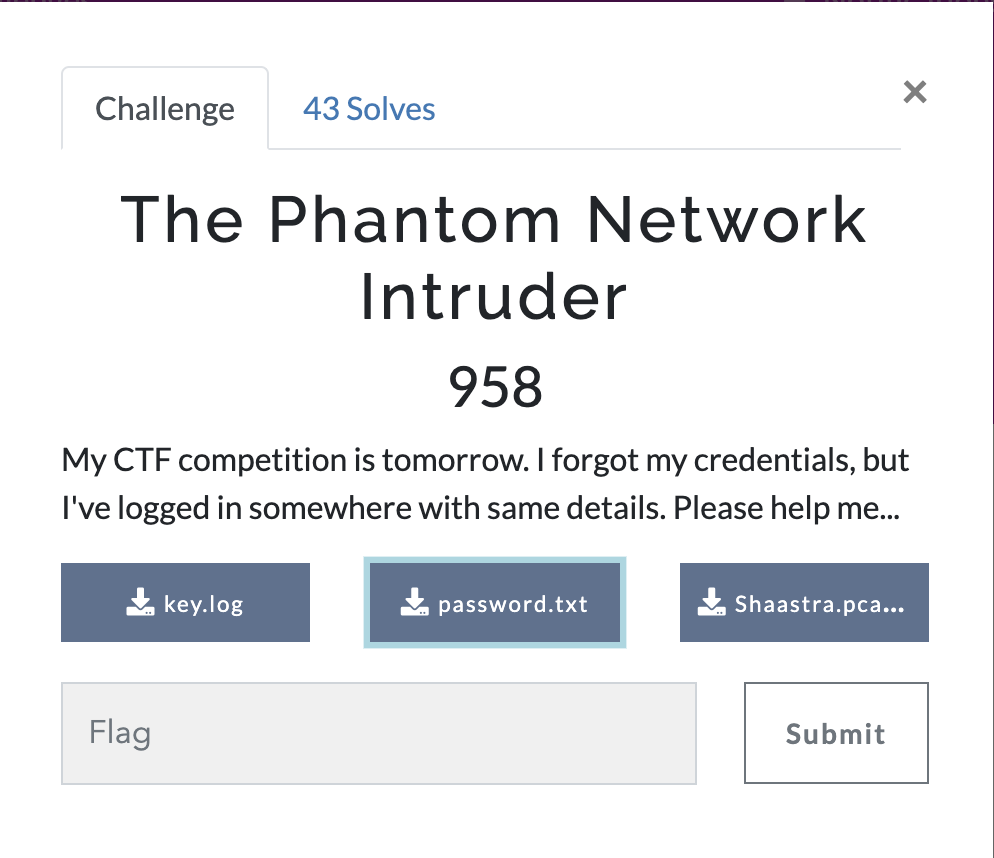
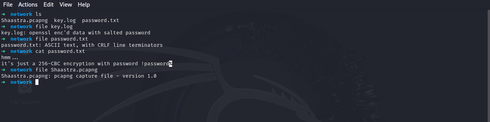
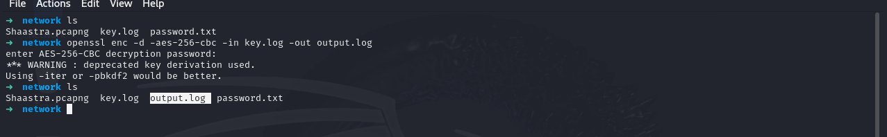
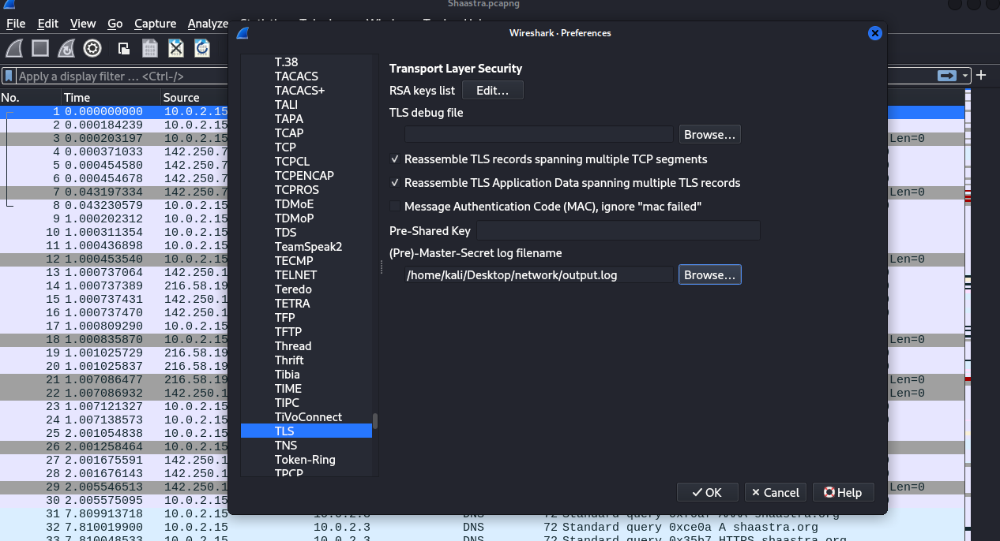

# The Phantom Network Intruder

My CTF competition is tomorrow. I forgot my credentials, but I've logged in somewhere with same details. Please help me...

<p align="center">
  
</p>

## Step1:-

We have been provided with three files:

- A .pcapng file
- A log file
- A password.txt file

The password.txt file contains the algorithm and password required to decrypt the log file.

<p align="center">
  
</p>

## Step2:-

Use the following command to decrypt the log file:

```bash
openssl enc -d -aes-256-cbc -in key.log -out output_key.log
```

<p align="center">
  
</p>

## Step3:-

The decrypted output_key.log file contains cryptographic keys and secrets used in the TLS handshake process to secure communication between a client and a server. These include traffic secrets, exporter secrets, and random values, which are essential for encrypting HTTP traffic over HTTPS.

We can assume the login credentials must be in the HTTP/HTTPS packets. Let’s log these TLS secrets to the .pcapng file and analyze the HTTP request using Wireshark.

<p align="center">

  
</p>

## Step4:-

Using the HTTP filter in Wireshark, we can analyze the packets. Within the (JSON) structure, we find the login credentials.

<p align="center">
  
</p>

The final flag is:

```bash
Shaastra{NE3WORK!NG}
```
