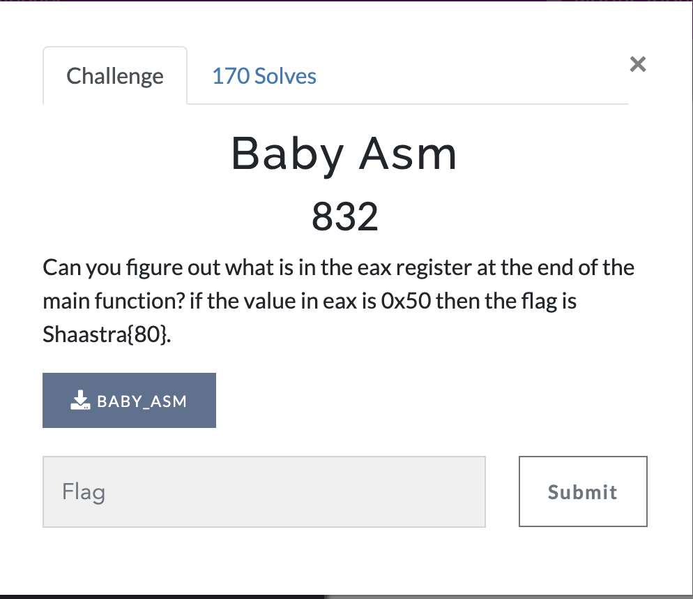
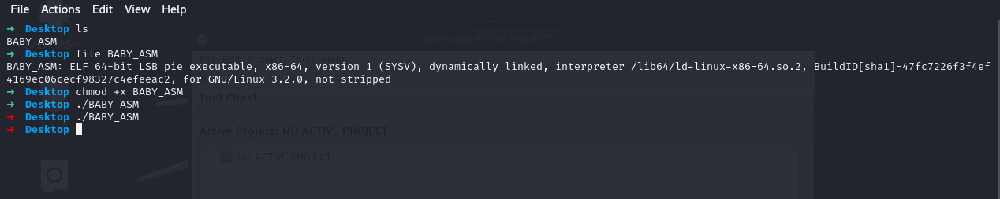
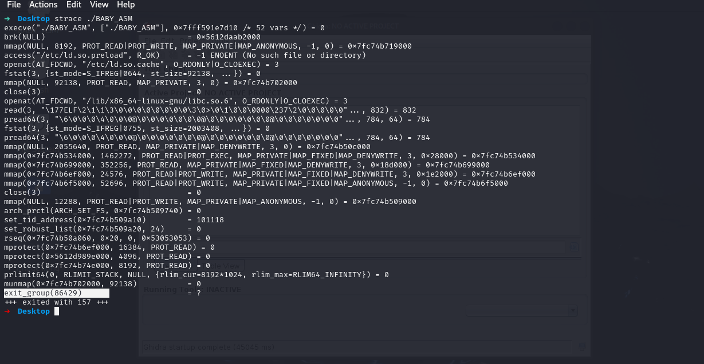

# Baby Asm

Can you figure out what is in the eax register at the end of the main function? if the value in eax is 0x50 then the flag is Shaastra{80}.

The eax register is a 32-bit register that typically holds the return value of a function in x86 architecture. Our task is to find the final value stored in eax, which corresponds to the return value of the main function.

<p align="center">
  
</p>

## Step1:-

We are provided with an x86-64 binary file. Running the binary does not produce any output.

<p align="center">
  
</p>

## Step3:-

Using the strings command does not provide useful information about the flag.

To analyze the program dynamically, we can trace system calls using strace or ftrace.

```bash
strace ./BABY_ASM
```

<p align="center">
  
</p> 
At the end of the execution, we see:

```bash
exit_group(86429)
```

Since the return value of the main function is stored in the eax register, the final flag is:

```bash
Shaastra{86429}
```
