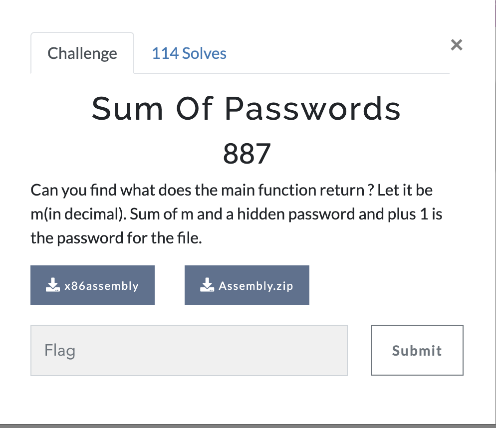

# Sum of Passwords
Can you find what does the main function return ? Let it be m(in decimal). Sum of m and a hidden password and plus 1 is the password for the file.

<p align="center">
  
</p>

## Step1:-

We are given two files: 
- A zip file, which is password protected.
- An x86 binary file, which contains part of the password.

First, we need to extract the password for the zip file.
<p align="center">
  
</p>

## Step2:-
To extract part of the password from the binary file, we use the strings command. This command helps to find readable text in the binary file, and in this case, we find the first part of the password: `13114119239`
<p align="center">
  
</p>

## Step3:-
we need to trace the system calls made by the binary to find the missing part of the password. We use strace (or ftrace) to analyze how the program interacts with the system. At the end of the trace, we observe the return value from the program:
```bash
exit_group(241452)
```

<p align="center">
  
</p>

This gives us the value of m, which is 241452<br>
```bash
Password = m + 1 + 13114119239
Password = 241452 + 1 + 13114119239
Password = 13114360692

```

## Step4:-
Using the password `13114360692`, we can now unzip the protected zip file.
<p align="center">
  
</p>

Once the file is unzipped successfully, we can extract the final flag: 

```bash
Shaastra{gn!7een!gnE_e$7e^e7}
```