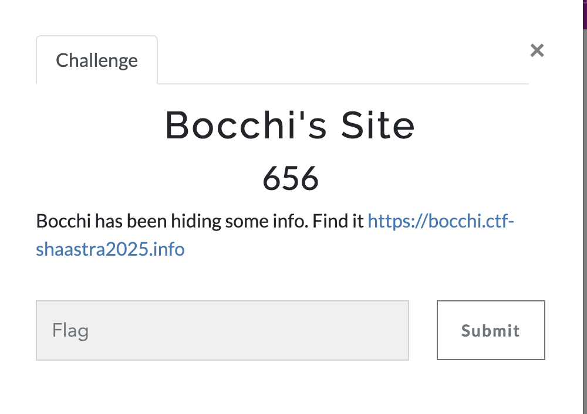
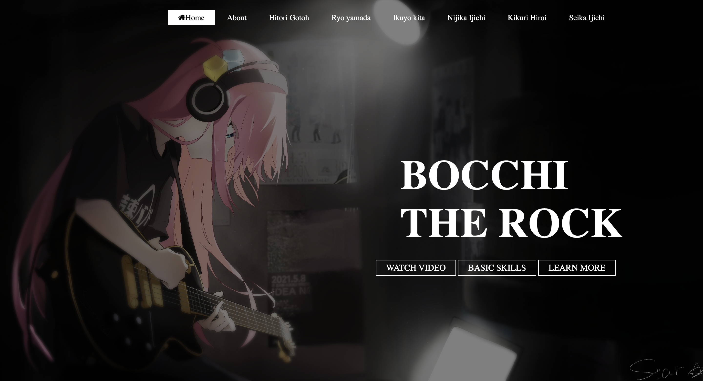
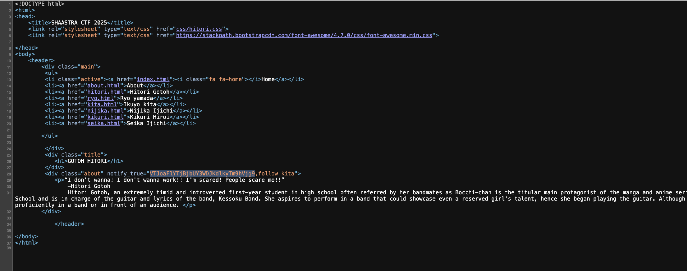
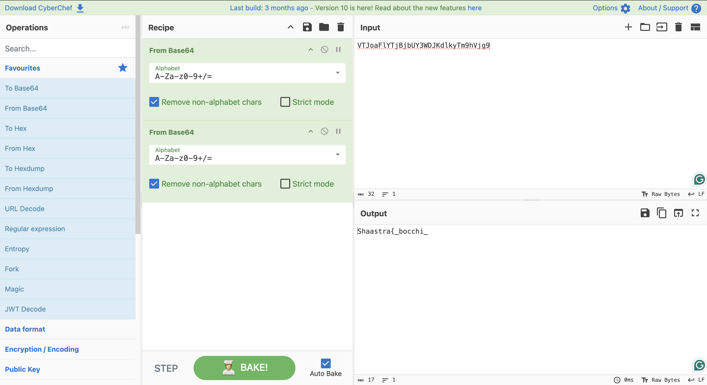
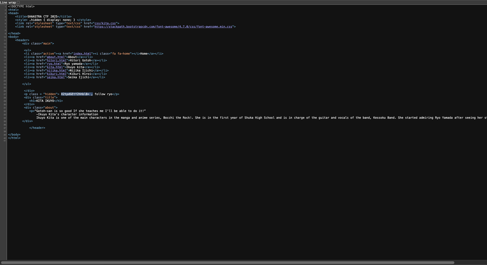
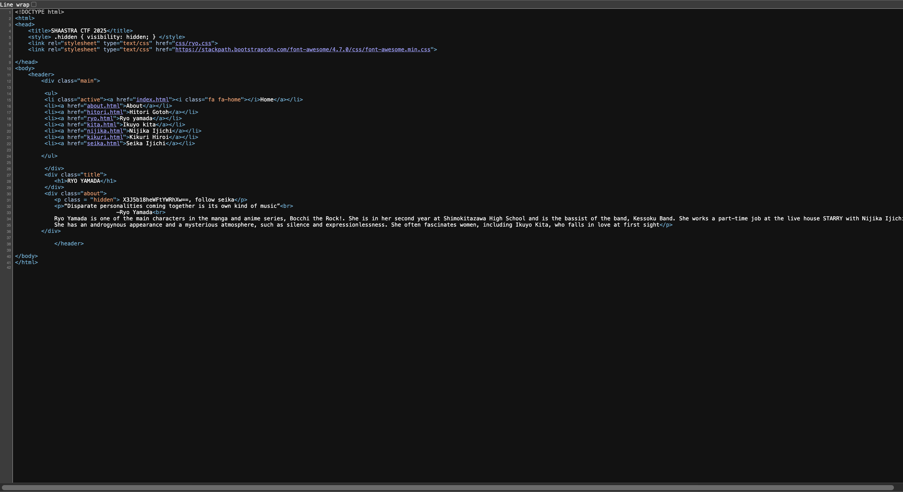
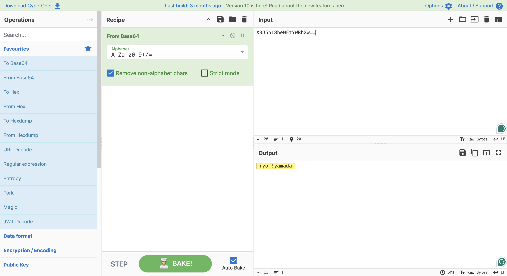
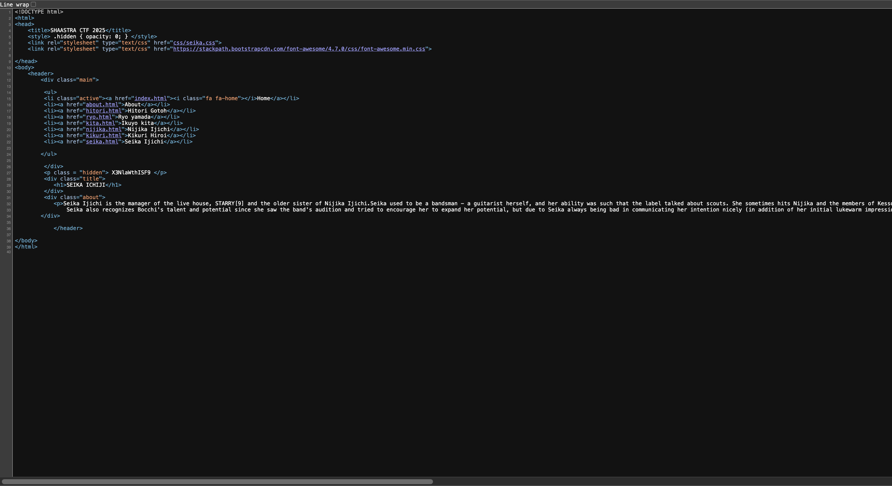
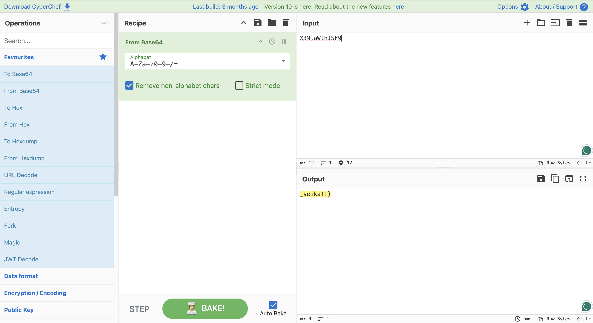

# Bocchi's Site
The main idea finding the flag is navigation in Inspect or source code of diffrent pages.<br>

<p align="center">
  
</p>

## Step 1:- 
usign the provided link https://bocchi.ctf-shaastra2025.info<br>
 we are encountered with this webpage:


<br>
 ## Step 2:-
 Usign the inspect tool of browser or directly view source code option.<br>
At the source code of GOTOH HITORI we found a hint and a followup for other part.<br>
using <b>Cyberchef</B> to decode the flag and following the step given.
<p align="center">
  
</p><p align="center">
  
</p><p align="center">
  
</p><p align="center">
  
</p><p align="center">
  
</p><p align="center">
  
</p><p align="center">
  
</p><p align="center">
  
</p>


## Step 3:-


The final flag coming out to be is <br>

```bash
Shaastra{_bocchi__kita-chan__ryo_!yamada__seika!!}
```
