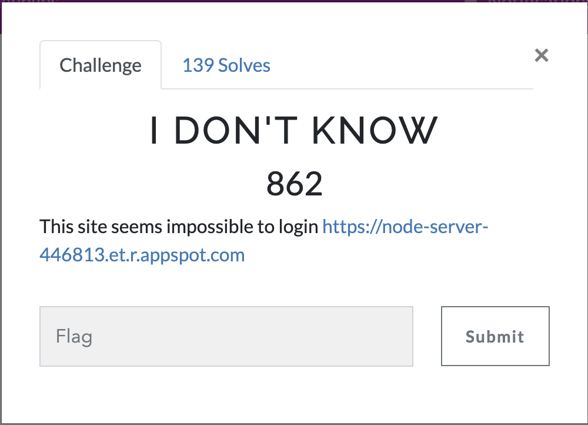
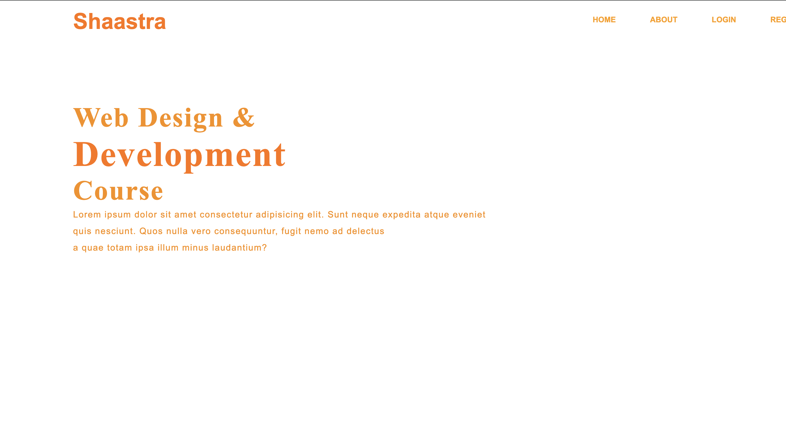
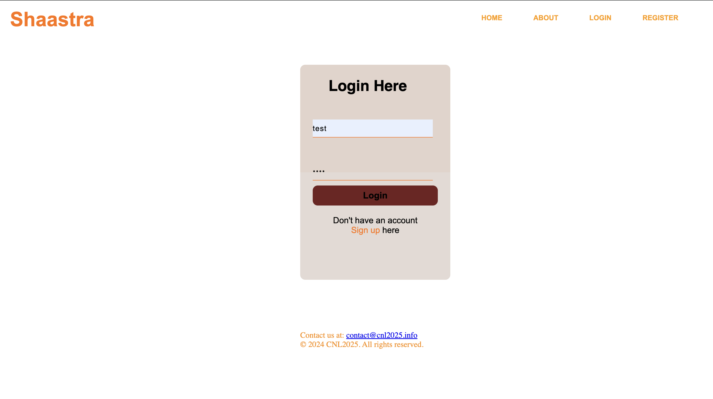
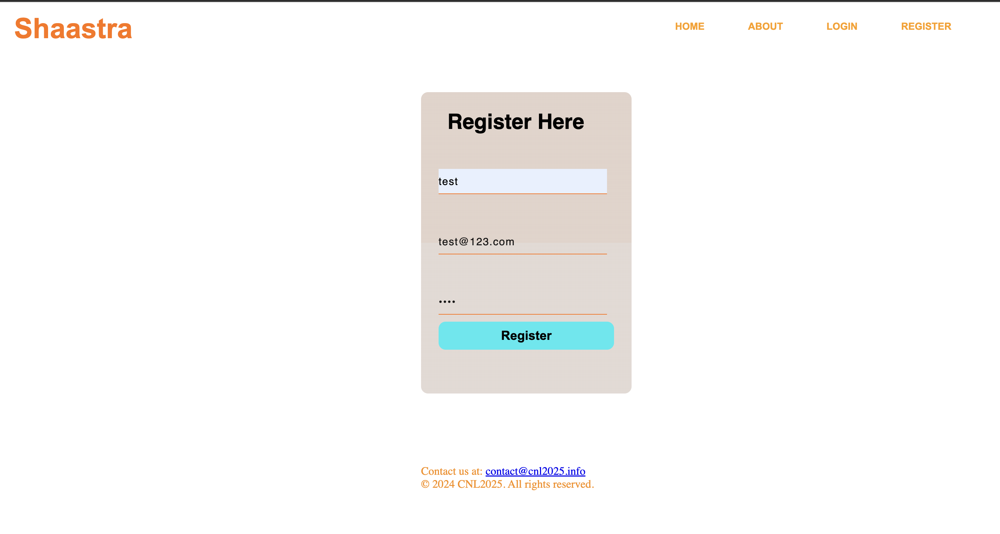
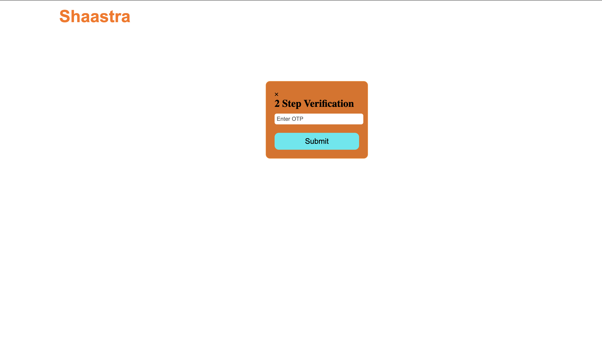
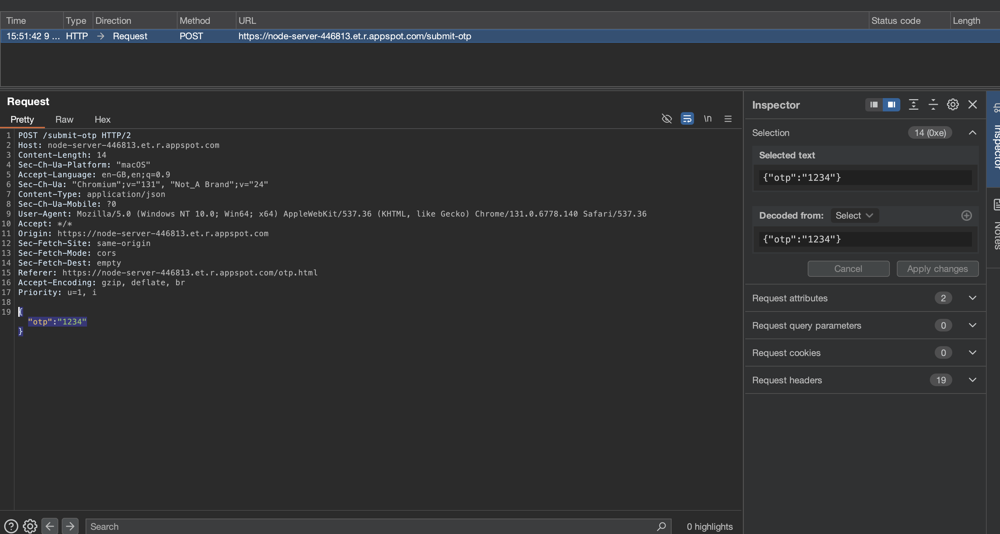
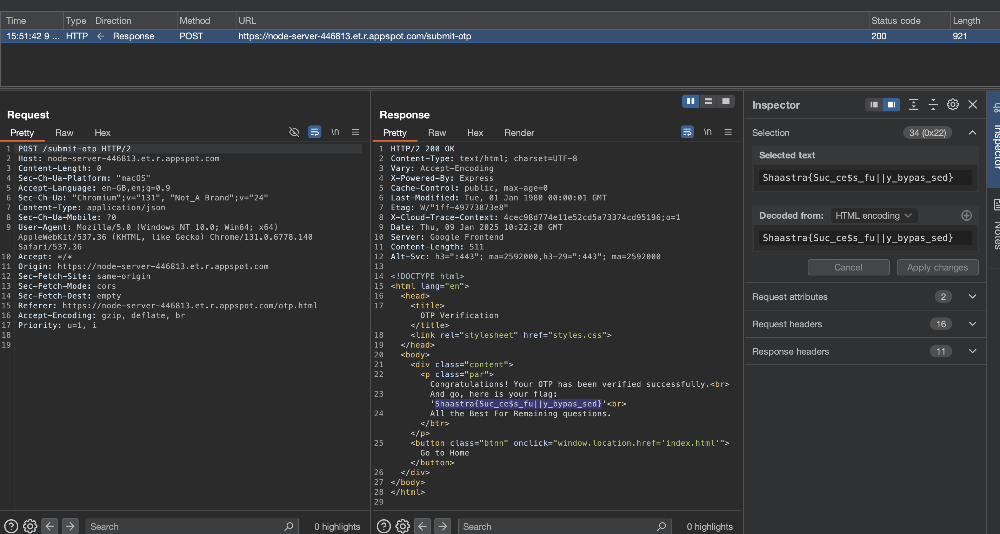

# I Don't Know

This site seems impossible to log in: https://node-server-446813.et.r.appspot.com

As the description suggests, we might need to perform a login-related attack. The login page does not provide any immediate hints, so we will explore different approaches to bypass authentication.

  

## Step1:-

There's nothing much on the home and about pages. Inspecting the page source and network requests does not reveal any hidden endpoints or credentials. 

  

## Step2:-

Let's try to log in using test credentials such as admin:admin or test:test to check if there are any weak default credentials allowed.

The login button seems to be not working. Examining the developer console reveals that it does not trigger a proper request. Instead of login, let's attempt registration to see how the authentication system works.

  

  

## Step3:-

Intercept this OTP request using Burp Suite. Upon submitting the registration form, the server sends an OTP verification request. By capturing this request, we can analyze the structure and potential vulnerabilities.

  

## Step4:-

Maybe try removing the OTP element from the JSON packet and resending the request. If the server does not validate the OTP properly, it might allow us to bypass the verification step.

By modifying the request and removing the OTP field, we can attempt to submit the registration process without actually verifying the OTP.

  

After modifying and resending the request, we successfully bypassed the OTP verification. This indicates that the authentication mechanism is flawed and does not properly enforce OTP validation. 

 

Bingo!! We got the flag `Shaastra{Suc_ce$s_fu||y_bypas_sed}`

This challenge demonstrates how improper validation of authentication mechanisms can lead to security vulnerabilities. Always ensure proper verification steps are enforced to prevent bypass attacks.

  

