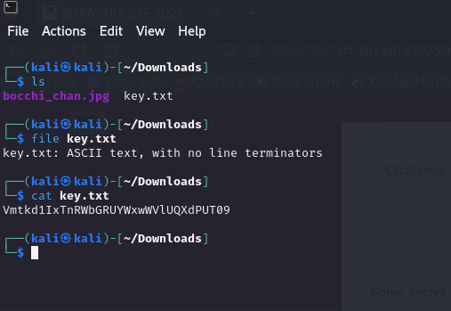

# Bit by Bit

## Some secret is hidden inside the png. Find the secret.<br>

Our objective is to find the hidden flag within the image.

<p align="center">
  
</p>

## Step1:-

First, let's inspect the provided files using the terminal.

<p align="center">
  
  
## Step2:-
Since the text in key.txt appears to be Base64-encoded, we can decode it using CyberChef.
```bash
Vmtkd1IxTnRWbGRUYWxwWVlUQXdPUT09 --> 7R2G6B
```
This might be an important hint for later steps.
</p><p align="center">
  
</p><p align="center">

## Step3:-

The challenge hint suggests analyzing the image using bit-plane slicing.
`Analyze the image using bit-planes. Ex: Stegonline, online resource to analyze images`

<br> 
  
</p><p align="center">

## Step4:-

Bit-plane slicing is a steganographic technique where data is hidden within the least significant bits (LSBs) of image pixels.

Upload the given `.jpeg` file on StegOnline.
use Extractfiles/data option.  
 

## Step5:-

Tick the bit option for RGB as decoded from key.txt file.
Extract the hidden text that appears in the bit-plane analysis.

</p><p align="center">
  
</p>
After correctly extracting the hidden message from the image, we retrieve the final flag:

```bash
Shaastra{ST3g@_N0_Gr@qhy.hehe}
```
